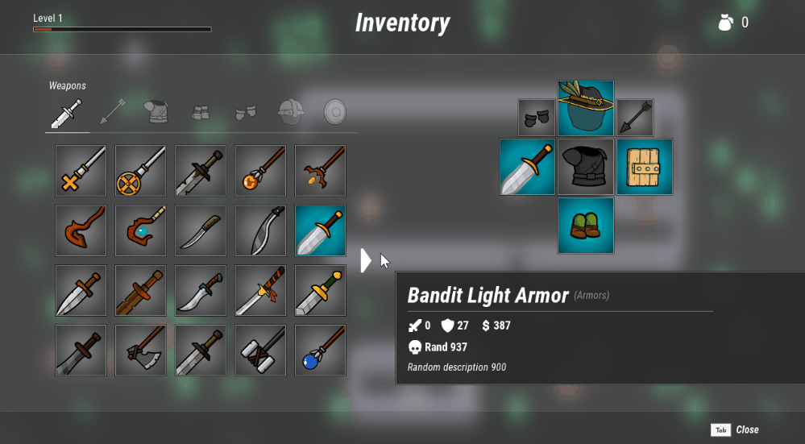
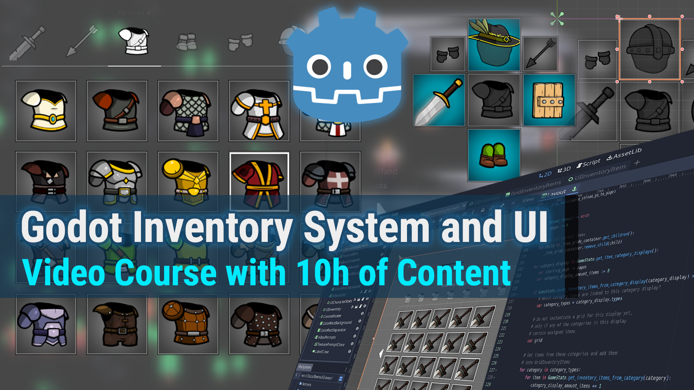

# Dynamic Inventory System and UI for Godot
 [](https://www.paypal.com/donate?hosted_button_id=FC5FTRRE3548C) [](https://www.patreon.com/alfredbaudisch) <a href='https://ko-fi.com/alfredbaudisch' target='_blank'></a>

Godot's fully dynamic inventory system, UI with infinite scrolling, item categories, equipment slots, database of items, inspired by Zelda Breath of the Wild.



-   [Project Features](#project-features)
-   [Video Course](#video-course)
    -   [Course Links](#course-links)
-   [Sponsorship and Donations](#sponsorship-and-donations)
    -   [Patrons](#patrons)
-   [Updates](#updates)
-   [Licenses](#licenses)
    -   [Asset Licenses](#asset-licenses)

## Project Features
Built from scratch, inspired by the Zelda Breath of the Wild inventory system and inventory UI, this is an extensive system:

-   **Fully Dynamic inventory and equipment system**: a database items separated **by categories** and also **groups of categories**, for example,  **One Handed Weapons and Two Handed Weapons are grouped under a Weapons group**, while keeping the One and Two Handed classifications.
- **Custom Scriptable Objects (Custom Godot's Resources)** with different attributes for items and equipment, **grouped in a database of items** (folder based, with Resource files).
-   **Responsive layout** adjustable for different aspect ratios.
-   **Custom UI widgets** (custom Control Nodes and Scenes)
-   **Infinite scrolling container and grids of items**, split it by pages, animated dynamically
-   List **multiple pages of items** under the same category.
-   User interface that uses both Dynamic and Static data
-   **Equippable Item slots that accept configurable categories** of items and show the items equipped in these slots
-   Item and **equipment attributes**
-   Handling and **syncing of One Handed and Two Handed items,** while automatically unequipping items if both hands are equipped
-  **Pickable / Pickup items, dynamically adding them to the inventory** and list them in the inventory screen, in the correct category
- UI sounds
- Godot version: **Godot 3.4.3** (Godot 4 is still too unstable and susceptible for breaking changes. When Godot 4 stable release comes out, the course and this source code will be upgraded).  

## Video Course
This source-code is built from scratch in the [**Complete Godot Course: Game User Interfaces Masterclass (Building a Dynamic Inventory System and UI with Godot)**](https://bit.ly/GodotUI). If you want to **learn how to make ALL of this from scratch**, check the course, while also support this project.

[](https://bit.ly/GodotUI)

**Game development course with 98 byte sized videos, with a total of 10 hours of video content**, where you are going to learn how to use the Godot Engine and Editor to create an **Inventory System and Inventory UI (User Interface) that is fully dynamic, with scriptable object items and a central database of items** (using Custom Godot's Resources). The inventory system has support for **multiple item categories, category groups, dynamic and infinite scrolling grids, equippable slots** (example: main hand and off hand) and more.  

### Course Links
- **[Itch](https://bit.ly/GodotUI)** (DRM-free videos)
- **[Skillshare](https://skl.sh/35VyvE1)**

You are going to **learn EVERYTHING** there is about creating **complex User Interfaces with Godot**, from scratch, as well as **coding and adding behavior to those interfaces, creating truly dynamic UI screens and components.**  

## Sponsorship and Donations
You can support the development of my open-source contributions and this project on [Patreon](https://www.patreon.com/alfredbaudisch), a [PayPal donation](https://www.paypal.com/donate?hosted_button_id=FC5FTRRE3548C) or [buy me a coffee with Ko-fi](https://ko-fi.com/alfredbaudisch). Or of course, [you can get the course](https://bit.ly/GodotUI) and learn how to make all of this from scratch.

Patrons and donors of any tier will have their name listed here. Patrons of the **Sponsors** tier or higher, can also have a link and a logo listed here.

### Patrons
-   Mike King

## Updates
For news and more code and art experiments and prototypes:

- Follow me on [Twitter 🐦](https://twitter.com/alfredbaudisch)
- Subscribe to my [YouTube channel 📺](https://www.youtube.com/alfredbaudischcreations)
- Subscribe to my [RSS feed](https://alfredbaudisch.com/feed)
- Bookmark my [website](https://alfredbaudisch.com)
- Or check [all of my links](https://linktr.ee/alfredbaudisch) to find your preferrable channel

## Licenses
This notice must be included in projects that use any code from this repository:

```
Copyright 2022 Alfred Reinold Baudisch (alfredbaudisch, pardall)

Licensed under the Apache License, Version 2.0 (the "License");
you may not use this file except in compliance with the License.
You may obtain a copy of the License at

    http://www.apache.org/licenses/LICENSE-2.0

Unless required by applicable law or agreed to in writing, software
distributed under the License is distributed on an "AS IS" BASIS,
WITHOUT WARRANTIES OR CONDITIONS OF ANY KIND, either express or implied.
See the License for the specific language governing permissions and
limitations under the License.
```

### Asset Licenses
These notices must be included in projects that assets from this repository (see more and links [here](./LICENSE_ASSETS.md)):

-   Course trailer music from ZapSplat
-   Fantasy Inventory Icons by Ragewortt. License: OGA-BY 3.0.
-   FREE Keyboard and controllers prompts pack by xelu. License: Public Domain, CC0.
-   Kenney Asset Packs. License: Public Domain, CC0.
-   Interface Sounds Starter Pack by p0ss. License: CC BY-SA 3.0.
-   Inventory Sound Effects by artisticdude. License: CC BY-SA 3.0.
